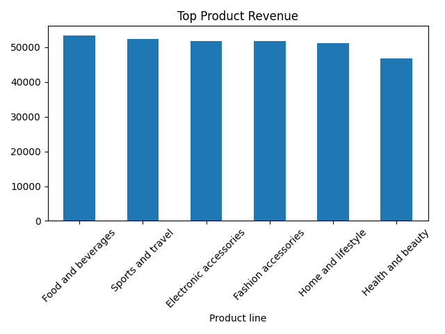
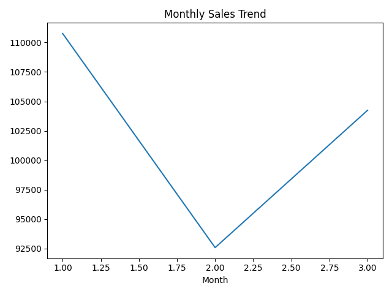
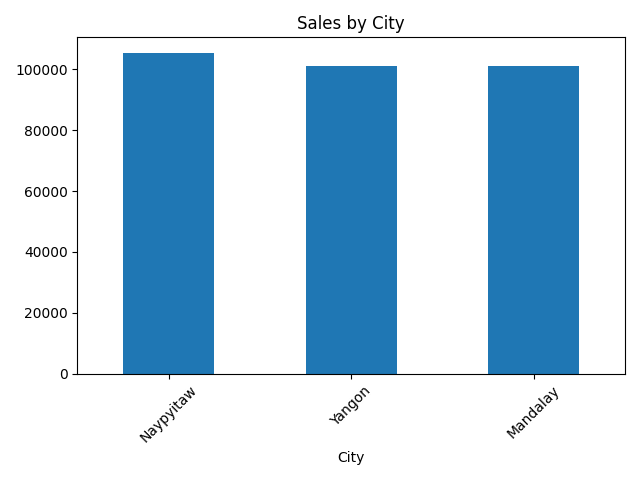

# 📊 Business Sales Performance Analysis

🚀 Data Science Internship Project

---

## 📌 Project Overview
This project analyzes supermarket sales data to extract meaningful insights and provide business recommendations.

---

## 🎯 Objectives
- Identify top revenue-generating products  
- Analyze sales trends over time  
- Evaluate city-wise performance  
- Understand customer behavior  

---

## 🛠️ Tools Used
- Python  
- Pandas  
- Matplotlib  
- Streamlit  

---

## 📊 Key Insights

### 🔹 Top Products
Certain product categories contribute the highest revenue.

### 🔹 Sales Trends
Sales vary across months, showing seasonal patterns.

### 🔹 City Performance
Some cities perform significantly better than others.

### 🔹 Customer Behavior
Member customers generate higher revenue.

---

## 📈 Visualizations







---

## 📄 Report
👉 Business_Sales_Report.pdf

---

## 🚀 Run Dashboard
```bash
streamlit run app.py
